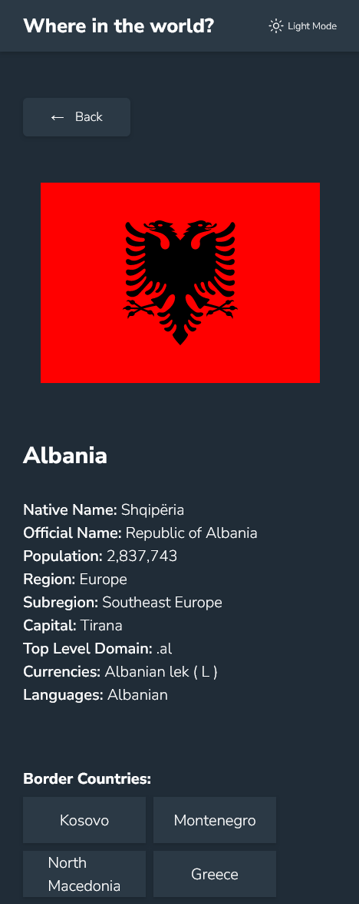

# Frontend Mentor - REST Countries API with color theme switcher solution

This is a solution to the [REST Countries API with color theme switcher challenge on Frontend Mentor](https://www.frontendmentor.io/challenges/rest-countries-api-with-color-theme-switcher-5cacc469fec04111f7b848ca) using Next.js 14.

## Table of contents

- [Overview](#overview)
  - [The challenge](#the-challenge)
  - [Screenshots](#screenshots)
  - [Links](#links)
- [My process](#my-process)
  - [Built with](#built-with)
  - [Highlights](#highlights)
    - [Theme toggler](#theme-toggler)
    - [Zero layout shifts](#zero-layout-shifts)
    - [Generate dynamic metadata](#generate-dynamic-metadata)
  - [Continued development](#continued-development)
- [Author](#author)

## Overview

### The challenge

Users are able to:

- See all countries from the API on the homepage
- Search for a country by name
- Filter countries by region and name
- Click on a country to see more detailed information on a separate page
- Click through to the border countries on the detail page
- Toggle the color scheme between light and dark mode

### Screenshots

Desktop:


Mobile:


&nbsp; &nbsp; &nbsp; &nbsp; &nbsp; &nbsp;


### Links

- Live Site URL: (https://countries-fzz87ncmk-catalina-hasnas.vercel.app/)

## My process

### Built with

- Semantic HTML5 markup
- CSS modules
- [Next.js](https://nextjs.org/) - React framework

### Highlights

#### Theme toggler

The first challenges for me was to set the initial theme according to the user prefference and avoid any flickering on page load.

I used a combination of CSS and Javascript for that, where css variables are initially set according to the user's preffered color theme.

```css
@media (prefers-color-scheme: dark) {
  :root {
    color-scheme: dark;
    --background: var(--background-dark);
    --elements: var(--elements-dark);
    --text: var(--text-dark);
    --accent: var(--accent-dark);
    --fill: var(--text-dark);
  }
}
```

isDarkTheme in ThemeProvider is initially undefined and only the user action can change it. When it happens, add data-theme attribute to body tag and use variables set in the attribute selector.

```tsx
export const Body = ({ children }: { children: ReactNode }) => {
  const { isDarkTheme } = useThemeProvider();

  const darkThemeMapper: Record<string, string> = {
    true: "dark",
    false: "light",
  };

  return (
    <body
      data-theme={
        isDarkTheme === undefined
          ? undefined
          : darkThemeMapper[isDarkTheme.toString()]
      }
    >
      {children}
    </body>
  );
};
```

```css
[data-theme="dark"] {
  --background: var(--background-dark);
  --elements: var(--elements-dark);
  --text: var(--text-dark);
  --accent: var(--accent-dark);
  --fill: var(--text-dark);
}
```

#### Zero layout shifts

The goal was to have zero layout shifts, which was implemented by using Next.js' Image with the fill prop set to true, which assigns `position: absolute` to the image, so it stretches to fill the parent container. From there, I used `object-fit` property on the image according to my needs.

- `cover` for the images inside the country cards, that need to fill the whole height and width of the space given in the container. This does mean that some flags that are especially long do not fit entirely in the space. In the designs, the width and height of the image is the same on all cards, so I couln't find a way around it.

```css
.countryCardImageContainer {
  position: relative;
  min-height: 13em;
}

.countryCardImage {
  object-fit: cover;
  object-position: center;
}
```

- `contain` for the images inside the country details page. The maximum height that the image container can have is controlled in `grid-template-areas` and the image is contained in the parent container.

```css
.countryDetailsContainer {
  display: grid;
  grid-template-columns: repeat(2, 1fr);
  grid-template-rows: min-content;
  grid-template-areas:
    "image description"
    "image border";
  gap: 2em;
}

.countryDetailsImageContainer {
  grid-area: image;
  position: relative;
}

.countryDetailsImage {
  object-fit: contain;
}
```


#### Generate dynamic metadata

Use Next.js' generateMetadata function that receives params from generateStaticParams to customize metadata of each page.

```tsx
export async function generateMetadata({
  params,
}: {
  params: { name: string };
}) {
  const { name } = params;

  const country: CountryDetailsWithBorders = await getCountryByNameWithBorders(
    name
  );

  return {
    title: `${country.name.common}`,
    icons: { icon: country.flags.svg },
  };
}
```


&nbsp; &nbsp;


### Continued development

I only played a little bit with animating the Back button and it was loads of fun! I would like to add more animations to make the app feel more friendly.


The problem is that I'm not very good at coming up with ideas on my own. So if anybody's reading who is interested in UI/UX and wants the challenge of upgrading the designs to a more modern version, I will gladly implement it!

## Author

- LinkedIn - [Catalina Hasnas](https://www.linkedin.com/in/catalina-hasnas-7481731b8/)
- Frontend Mentor - [@Catalina-Hasnas](https://www.frontendmentor.io/profile/Catalina-Hasnas)
